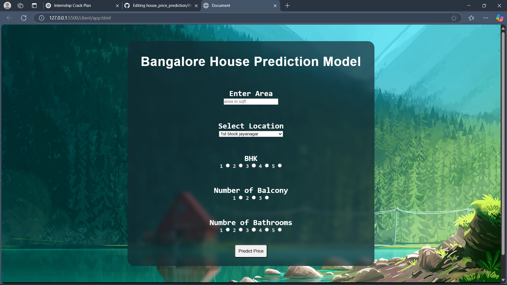

# 🏠 House Price Prediction Web App

A full-stack machine learning web application to predict house prices based on various features. Built with **Flask** (Backend), **HTML/CSS/JavaScript** (Frontend), and deployed on **Railway.app**. The app takes user input via a simple form, processes it through a trained ML model, and returns the predicted price in real-time. 🚀

---

## ✨ Features  
- 🎯 Predict house prices using a trained regression ML model  
- 🖥️ Interactive UI with form-based input  
- 🔄 Real-time result rendering with Flask  
- 📡 Deployed and accessible via web  
- 📊 Clean architecture: frontend + backend + ML + deployment

---

## 🛠 Tech Stack  
- **Frontend:** HTML, CSS, JavaScript  
- **Backend:** Python (Flask)  
- **ML & Data Processing:** Scikit-learn, NumPy, Pandas  
- **Deployment:** Railway.app  

---

## 📸 Screenshots

### 🔷 Homepage (User Input Form)  


---

## 🎥 Live Demo  


> 👆 Watch the app in action — form input, prediction, and result displayed live. GIF created using LICEcap.

---

## 🚀 Installation & Setup  

### 1️⃣ Clone the Repository  
```bash
git clone https://github.com/Saurabh-004/house_price_prediction
```

### 2️⃣ Create a Virtual Environment (Recommended)
```bash
python -m venv venv
source venv/bin/activate      # Mac/Linux  
venv\Scripts\activate         # Windows
```

### 3️⃣Install the Dependencies
```bash
pip install -r requirements.txt
```
### 4️⃣ Run the Flask App
```bash
python server.py
Then open http://localhost:5000 in your browser.
```

📁 Folder Structure
cpp
Copy
Edit
├── model.pkl
├── server.py / app.py
├── static/
├── templates/
├── assets/
│   ├── homepage.png
│   └── demo.gif
├── README.md
└── requirements.txt

👨‍💻 Author
Saurabh Vishwakarma
📚 BCA + Data Science @ IIT Madras
🔗 LinkedIn • GitHub


